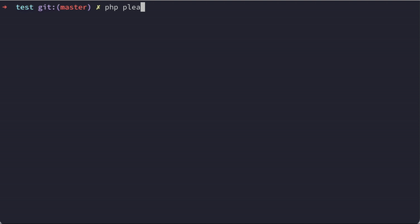

# Statamic Clear Assets


[](https://packagist.org/packages/swiftmade/statamic-clear-assets)


Clean up unused images and assets from your Statamic site. Saves storage, keep things tidy.

The addon scans your entire `content` directory. If an asset is not referenced in any of your content, it will be marked as unused. You can review the list of unused assets and delete them.

The addon is easy to configure. See the [Configuration](#configuration) section below.



## How to Install

You can search for this addon in the `Tools > Addons` section of the Statamic control panel and click **install**, or run the following command from your project root:

```bash
composer require swiftmade/statamic-clear-assets
```

## How to Use

Simply run:

```bash
php please assets:clear
```

## Configuration

To publish the config file, use:

 ```bash
 php artisan vendor:publish --tag=statamic-clear-assets-config
 ```

Here's all of the configuration options with their defaults:

```php
return [

    /**
     * Where should we look to see if assets are still referenced or not?
     * If you're referencing assets elsewhere in your codebase, add those paths here.
     * All paths are relative to the base_path()
     */
    'scan_folders' => [
        'content',
    ],

    /**
     * All assets from these containers will be left alone.
     * You can see all your asset containers under content/assets folder.
     */
    'ignore_containers' => [
        'favicons',
        'social_images',
    ],

    /**
     * If we come across these filenames, we'll just leave them alone.
     * You can use "*" as a wildcard. eg: "IMAGE*.jpg" will ignore IMAGE1.jpg IMAGE23.jpg etc...
     */
    'ignore_filenames' => [
        //
    ],

    /**
     * You might not want to delete very fresh assets, as perhaps you want to use them soon.
     * Use this config to only detect and delete files older than x days.
     */
    'minimum_age_in_days' => 0,
];
```
